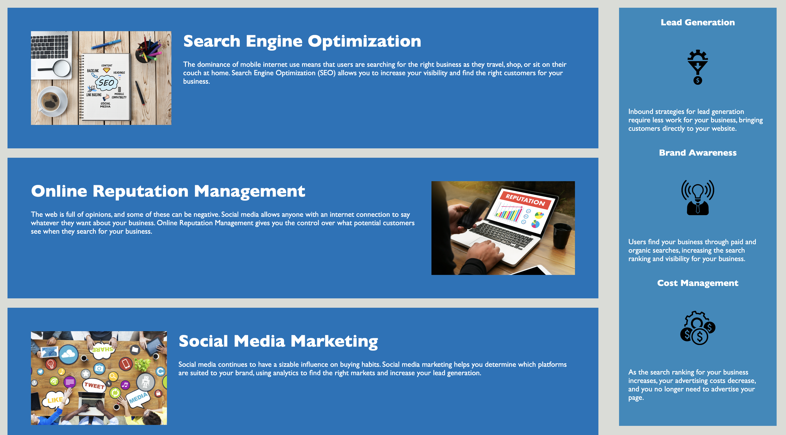

# wk1-refactor-challenge

## Description

This project involved refactoring a website for a company called Horiseon, who specializes in digital marketing, to make it more accessible. 

The aim is to improve the search engine optimization of the website and enhance the user experience for people with disabilities.

During this project, I learnt the importance of version control using GitHub and also how to apply semantic elements to an HTML file.

## Table of Contents

- [User Story](#user-story)
- [Acceptance Criteria](#acceptance-criteria)
- [Usage](#usage)
- [Credits](#credits)
- [License](#license)

## User Story

```
AS A marketing agency
I WANT a codebase that follows accessibility standards
SO THAT our own site is optimized for search engines
```

## Acceptance Criteria

Your website must meet accessibility standards. You can achieve this completing the following:

* Semantic HTML elements can be found throughout the source code
* HTML elements follow a logical structure independent of styling and positioning
* Image and icon elements contain accessible `alt` attributes
* Heading attributes fall in sequential order
* Title elements contain a concise, descriptive title


## Usage

 
 

 

 

## Credits

This project was completed as part of an edX BootCamp coding challenge. The starter code was provided, and the refactoring was done by Jake Henry.

References for semantic HTML elements guidance: 

W3Schools - https://www.w3schools.com/html/html5_semantic_elements.asp

ByteGrad - https://www.youtube.com/watch?v=bOUhq46fd5g

edX module slides - https://bootcampspot.instructure.com/courses/5076/modules


References for README guidance:

GitHub Pages: https://coding-boot-camp.github.io/full-stack/github/professional-readme-guide

## License

This project is licensed under the MIT License.